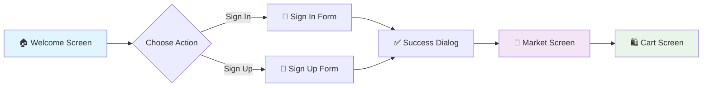

# �� Super Market App

<div align="center">

[](https://flutter.dev)
[](https://dart.dev)
[](LICENSE)
[](https://flutter.dev)

**A modern Flutter mobile application for a supermarket with user authentication, product browsing, cart management, and special offers.**

[📱 **Watch App Preview**](https://drive.google.com/file/d/1UImVVAJMyFOxLvitKQv0EoD7UlpZ4gBW/view?usp=sharing)

[Features](#-features) •
[Installation](#-installation--setup) •
[Screenshots](#-screenshots) •
[Technologies](#-technologies-used) •
[Contributing](#-contributing)

</div>

---

## ✨ Features

<div align="center">

### 🔐 **Authentication System**
- ✅ **Welcome Screen** with navigation to sign-in/sign-up
- ✅ **Sign-Up Form** with validation:
  - 📝 Full Name (first letter must be uppercase)
  - 📧 Email (must include @)
  - 🔒 Password (minimum 6 characters)
  - 🔄 Confirm Password (must match)
- ✅ **Sign-In Form** with validation:
  - 📧 Email (must include @)
  - 🔒 Password (minimum 6 characters)
- ✅ **Success Dialogs** with smooth navigation
- ✅ **Real-time Form Validation**

### 🛍️ **Shopping Experience**
- 🎉 **Welcome Message** for users
- 🍔 **Featured Food Section** (PageView)
  - ↔️ Horizontal scrollable cards
  - 🎨 Beautiful gradient backgrounds
  - 🍕 Food items: Burger, Pizza, Pasta, Salad
- 🛒 **Products Section** (GridView)
  - 📊 2x2 grid layout
  - 🍎 Fresh groceries: Apple, Banana, Orange, Milk
  - ➕ Add to cart functionality
- 🔥 **Hot Offers Section** (ListView)
  - 📜 Vertical list of special deals
  - 💰 Discounted items with descriptions

### 🛒 **Cart Management**
- 🛍️ **Shopping Cart Screen** with:
  - 📋 Cart items display
  - ⚙️ Quantity controls (add/remove)
  - 💲 Total price calculation
  - 💳 Checkout functionality
  - 🛒 Empty cart state with "Continue Shopping"

### 🎨 **UI/UX Features**
| Feature | Description | Status |
|---------|-------------|--------|
| 🌊 **Smooth Transitions** | Between screens | ✅ |
| 🎯 **Consistent Font** | Suwannaphum-Regular | ✅ |
| 🎨 **Material Design** | Modern components | ✅ |
| 🖼️ **Offline Visuals** | Gradient containers & icons | ✅ |
| 📱 **Responsive Layout** | Proper spacing | ✅ |
| 🎪 **Modern Cards** | Shadows and gradients | ✅ |

</div>

---

## 📱 Screenshots

<div align="center">

### 🏠 **Welcome & Authentication**


### 🛒 **Shopping Experience**


</div>

---

## 🛠️ Technologies Used

<div align="center">

**Core Technologies:**
- 🎯 **Flutter** - UI framework
- 🎨 **Dart** - Programming language  
- 📱 **Material Design** - UI components
- 🌐 **Offline-First** - No network dependencies
- ✅ **Form Validation** - Input validation
- 🧭 **Navigation** - Screen routing

</div>

---

## 📁 Project Structure

```
📦 flutter_application_1/
├── 📁 lib/
│   ├── 📄 main.dart                 # 🚀 App entry point
│   ├── 📁 models/
│   │   └── 📄 product_model.dart    # 🛍️ Product data model
│   ├── 📁 screens/
│   │   ├── 📄 welcome_screen.dart   # 👋 Welcome/landing screen
│   │   ├── 📄 signin_screen.dart    # 🔑 User sign-in
│   │   ├── 📄 signup_screen.dart    # 📝 User registration
│   │   ├── 📄 market_screen.dart    # 🛒 Main shopping screen
│   │   └── 📄 cart_screen.dart      # 🛍️ Shopping cart
│   ├── 📁 utils/
│   │   └── 📄 validators.dart       # ✅ Form validation utilities
│   └── 📁 assets/
│       └── 🖼️ (image assets)
├── 📄 pubspec.yaml                  # 📦 Dependencies
└── 📄 README.md                     # 📖 This file
```

---

## 🚀 Installation & Setup

### 📋 Prerequisites

<div align="center">


</div>

- 🎯 Flutter SDK (3.8.1 or higher)
- 🎨 Dart SDK
- 🛠️ Android Studio / VS Code
- 📱 Android Emulator or Physical Device

### 📥 Installation Steps

```bash
# 1️⃣ Clone the repository
git clone <repository-url>
cd flutter_application_1

# 2️⃣ Install dependencies
flutter pub get

# 3️⃣ Run the application
flutter run
```

<div align="center">

> 🎉 **That's it!** Your app should now be running on your device/emulator.

</div>

---

## ⚙️ Configuration

<details>
<summary><strong>📦 Assets Configuration</strong></summary>

Make sure your `pubspec.yaml` includes:
```yaml
flutter:
  uses-material-design: true
  assets:
    - assets/
```

</details>

<details>
<summary><strong>🔤 Font Configuration</strong></summary>

The app uses the **Suwannaphum-Regular** font family. Ensure it's properly configured in your theme.

</details>

---

## 📋 App Flow

<div align="center">



</div>

1. **🏠 Welcome Screen** → Choose Sign In or Sign Up
2. **🔐 Authentication** → Form validation and success dialog
3. **🛒 Market Screen** → Browse featured food, products, and offers
4. **🛍️ Cart Screen** → Manage items and checkout

---

## 💡 Features Implementation

<div align="center">

### 📝 Form Validation Rules

| Field | Rule | Icon |
|-------|------|------|
| **Name** | Must start with uppercase letter | ✅ |
| **Email** | Must contain @ symbol | 📧 |
| **Password** | Minimum 6 characters | 🔒 |
| **Confirm** | Must match password | 🔄 |

### 🎨 Screen Layouts

| Section | Type | Description |
|---------|------|-------------|
| **Featured Food** | PageView | Horizontal gradient cards |
| **Products** | GridView | 2x2 grid with add-to-cart |
| **Hot Offers** | ListView | Vertical deal descriptions |

</div>

### 🧭 Navigation
- **Route-based navigation** using named routes
- **Smooth transitions** between authentication and market screens  
- **Dialog-based confirmations** for user actions

---

## 🤝 Contributing

<div align="center">

**We welcome contributions!** 🎉

</div>

1. 🍴 Fork the repository
2. 🌿 Create a feature branch (`git checkout -b feature/amazing-feature`)
3. 💫 Commit your changes (`git commit -am 'Add amazing feature'`)
4. 🚀 Push to the branch (`git push origin feature/amazing-feature`)
5. 🎯 Create a Pull Request

---

## 🔮 Future Enhancements

<div align="center">

<table>
<tr>
<td width="50%">

### 👤 **User Features**
- [ ] 🏠 User profile management
- [ ] 📋 Order history  
- [ ] 🔔 Push notifications
- [ ] ❤️ Wishlist feature

</td>
<td width="50%">

### 🛒 **Shopping Features**
- [ ] 💳 Payment integration
- [ ] 🔍 Product search functionality
- [ ] ⭐ Product reviews and ratings
- [ ] 💰 Multiple payment methods
- [ ] 🚚 Delivery tracking

</td>
</tr>
</table>

</div>

---

## 📄 License

<div align="center">

This project is licensed under the **MIT License** - see the [LICENSE](LICENSE) file for details.

[](https://opensource.org/licenses/MIT)

</div>

---

<div align="center">

**🎨 Built with ❤️ using Flutter**

⭐ **Star this repo if you like it!** ⭐


</div>
